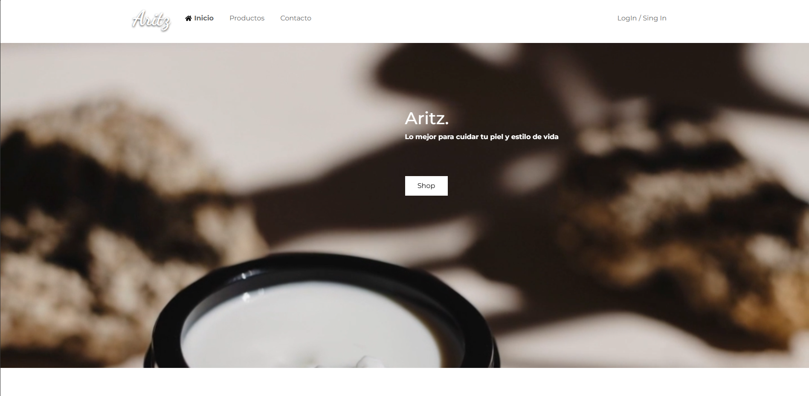
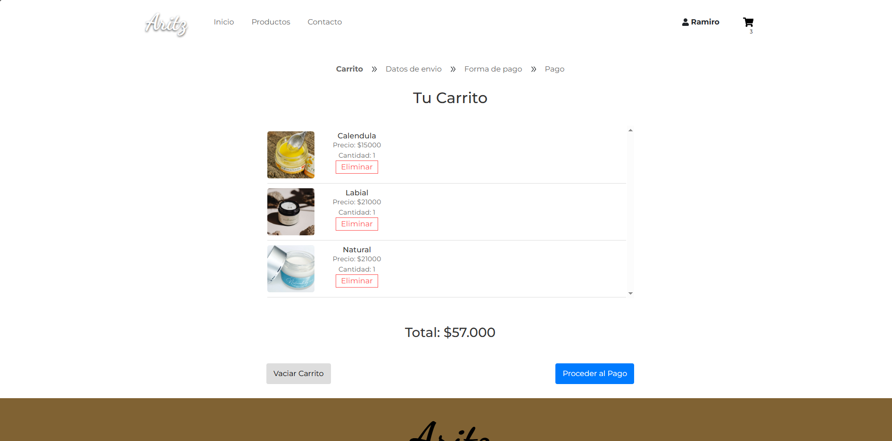

<br />
<div align="center">
  <a href="https://github.com/unreinramiro/aritzCosmetica">
    Aritz
  </a>

  <h3 align="center">Aritz Cosmetica Natural</h3>

  <p align="center">
    Una plataforma moderna de compras construida con la robustez de .NET y la velocidad de React.
    <br />
    <a href="URL_DEL_DEMO_SI_TIENES"><strong>Ver Demo »</strong></a>
    <br />
    <br />
    <a href="#bug">Reportar Bug</a>
    ·
    <a href="#feature">Solicitar Feature</a>
  </p>
</div>

<!-- BADGES (TECNOLOGÍAS) -->
<div align="center">


</div>

<!-- TABLA DE CONTENIDOS -->
<details>
  <summary>Tabla de Contenidos</summary>
  <ol>
    <li><a href="#sobre-el-proyecto">Sobre el Proyecto</a></li>
    <li><a href="#tecnologías">Tecnologías</a></li>
    <li><a href="#capturas">Capturas de Pantalla</a></li>
    <li><a href="#instalación">Instalación</a></li>
    <li><a href="#contacto">Contacto</a></li>
  </ol>
</details>

## 🚀 Sobre el Proyecto

Aritz es un e-commerce diseñado para la venta de cosmética natural, permitiendo gestión de usuarios, carrito de compras, panel de administración y pasarela de pagos con MercadoPago.

## 📸 Capturas de Pantalla

<!-- Usa una tabla para organizar las imágenes y que no queden gigantes -->
| Home Page | Carrito de Compras |
|:---------:|:------------------:|
|  |  |

| Panel Admin | Detalle Producto |
|:-----------:|:----------------:|
|  |  |

## 🛠 Tecnologías

*   **Frontend:** React.js, Bootstrap 5, SweetAlert2, Axios.
*   **Backend:** ASP.NET Core Web API, Entity Framework Core.
*   **Base de Datos:** SQL Server.
*   **Pagos:** MercadoPago SDK.

## ⚙️ Instalación

1. Clonar el repositorio
   ```sh
   git clone https://github.com/TU_USUARIO/TU_REPO.git

## 🗄️ Base de Datos

El proyecto utiliza Entity Framework Core Code First.
1.  Configura tu cadena de conexión en `appsettings.json`.
2.  Abre la consola en la carpeta del proyecto backend.
3.  Ejecuta: `dotnet ef database update`.
    *   Esto creará automáticamente la base de datos y todas las tablas.
